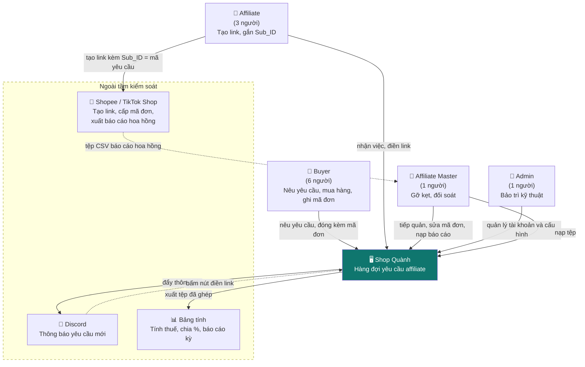
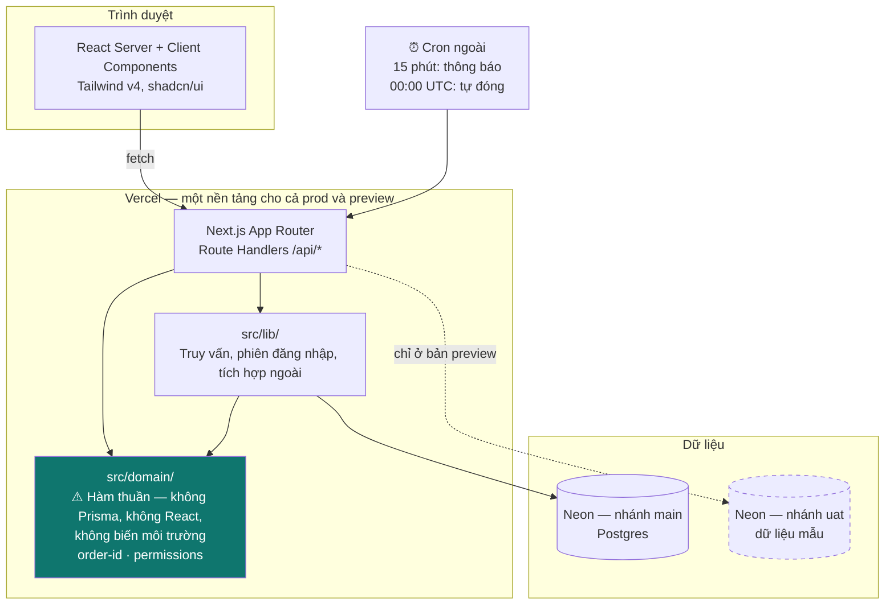

# C4 — Context & Container

| 📄 **Metadata** | 📑 **Details** |
|:---|:---|
| **Doc ID** | `diagrams-c4` |
| **Version** | `1.0.0` |
| **Status** | 🟡 **Draft** |
| **Last Updated** | `2026-08-11` |
| **Owner** | Quành (Admin) |
| **Upstream** | [tech-spec-architecture] |
| **Downstream** | — |

Chỉ hai tầng. Component và Code bị bỏ có chủ ý: chúng lỗi thời ngay tuần đầu, và tầng Code chính là mã nguồn.

## C1 — Bối cảnh

Dùng để quyết định: **cái gì nằm trong tầm kiểm soát của ta, cái gì không.** Mọi thứ hình chữ nhật viền đứt là thứ ta phải chấp nhận theo hiện trạng của họ.

**Ranh giới quan trọng nhất trong sơ đồ này:** mũi tên từ hệ thống sang bảng tính. Hệ thống lo **ghép nối dữ liệu**; bảng tính lo **tiền nong**. Ranh giới đó được chốt ở problem-definition §10.9 và không được xê dịch — mỗi lần có ý định đưa phép tính tiền vào hệ thống, quay lại nhìn mũi tên này.

**Ranh giới thứ hai:** Sub_ID đi từ Affiliate sang sàn, **không** đi qua hệ thống. Hệ thống chỉ hiển thị mã để sao chép và ghi nhận lời khai rằng đã gắn. Đây là gốc của TR-8.

## C2 — Container

Dùng để quyết định: **logic nào phải test được không cần cơ sở dữ liệu.**

**Mũi tên không tồn tại là phần quan trọng nhất:** `src/domain/` không có mũi tên nào đi ra. Đó là ranh giới duy nhất được thực thi nghiêm, bằng ESLint chứ không bằng kỷ luật con người. Lý do chọn đúng hai vùng này nằm ở tech-spec §2.2: cả hai đều là loại **lỗi im lặng** — sai mà không có thông báo lỗi nào.
