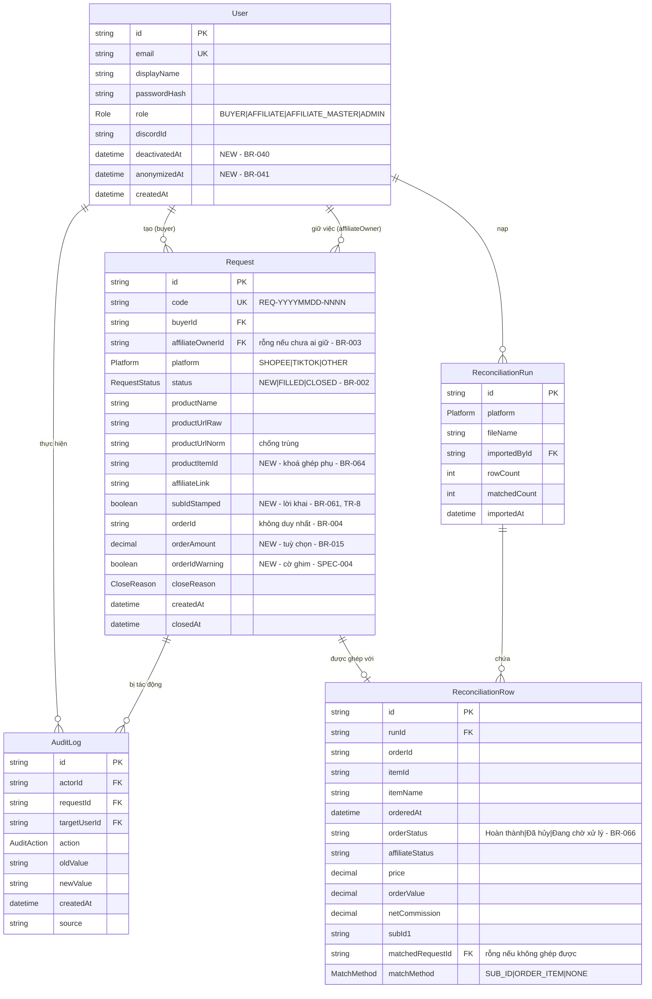

# ERD

| 📄 **Metadata** | 📑 **Details** |
|:---|:---|
| **Doc ID** | `diagrams-erd` |
| **Version** | `1.0.0` |
| **Status** | 🟡 **Draft** |
| **Last Updated** | `2026-08-11` |
| **Owner** | Quành (Admin) |
| **Upstream** | [tech-spec-architecture], [business-rules] |
| **Downstream** | — |

Tên bảng và trường khớp với từ điển miền ở `02-business-rules.md` §1 và mô hình dữ liệu ở `05-tech-spec-architecture.md` §3. Trường **in đậm trong chú thích** là phần thêm mới ở đợt này.

## Quyết định mà sơ đồ này thể hiện

**1. `orderId` không phải khoá duy nhất.** BR-004: một đơn gộp nhiều sản phẩm nên nhiều `Request` dùng chung một mã. Đã kiểm chứng trên dữ liệu thật — 91 dòng báo cáo chỉ có 65 mã đơn. Đặt ràng buộc duy nhất lên trường này là lỗi rất dễ mắc và sẽ chặn đúng tình huống hợp lệ nhất.

**2. `User` có hai quan hệ khác nhau tới `Request`.** Người tạo và người giữ việc là hai vai riêng, và một người có thể vừa là cả hai trên hai yêu cầu khác nhau.

**3. Không có cột nào lưu `stale`.** BR-026: đó là giá trị suy dẫn từ trạng thái cộng thời gian trôi qua. Lưu thì sẽ có ngày dữ liệu lưu lệch với thực tế và không ai biết bên nào đúng.

**4. Hai bảng đối soát chỉ trỏ một chiều vào `Request`.** Không có khoá ngoại nào đi ngược lại. Xoá sạch dữ liệu đối soát không ảnh hưởng gì tới nghiệp vụ chính — đó là chủ ý, để phần mới nhất và dễ sai nhất luôn vứt đi làm lại được.

**5. Không có thao tác `DELETE` nào trên `User`.** BR-042: ẩn danh hoá là cập nhật tại chỗ, giữ nguyên mọi khoá ngoại. Nếu bạn thấy dòng code nào xoá cứng `User`, đó là lỗi.
