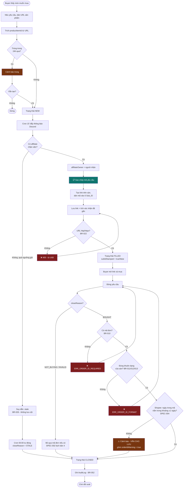
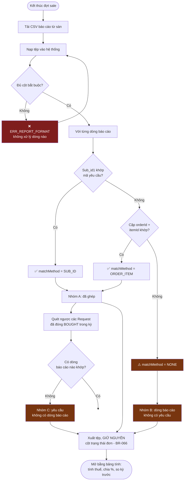
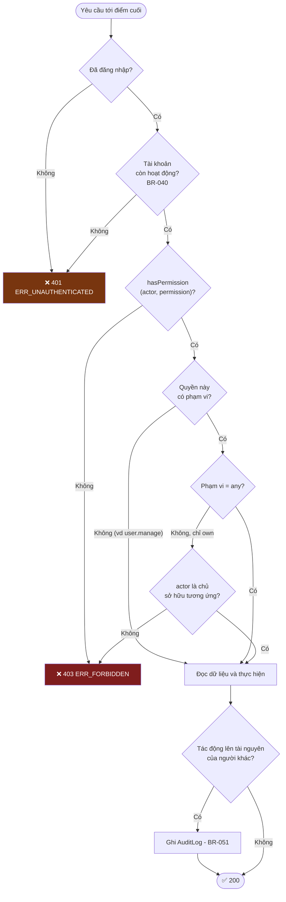

# Flowchart

| 📄 **Metadata** | 📑 **Details** |
|:---|:---|
| **Doc ID** | `diagrams-flowchart` |
| **Version** | `1.0.0` |
| **Status** | 🟡 **Draft** |
| **Last Updated** | `2026-08-11` |
| **Owner** | Quành (Admin) |
| **Upstream** | [sdd], [business-rules] |
| **Downstream** | — |

Ba luồng, không hơn. Vẽ hết mọi luồng thì không ai cập nhật và sơ đồ chết sau một tháng.

## 1. UC-1 — Vòng đời một yêu cầu (ưu tiên cao nhất)

Dùng để quyết định: **chỗ nào cần chặn, chỗ nào chỉ cảnh báo.**

**Quy tắc phân biệt đỏ và cam:** đỏ là chặn — dữ liệu chắc chắn sai và sửa được ngay. Cam là cảnh báo — có thể sai, có thể không, và người dùng biết rõ hơn hệ thống. Cảnh báo giả nguy hiểm hơn không cảnh báo: sai vài lần là người ta bỏ qua mọi cảnh báo về sau, kể cả cảnh báo đúng.

## 2. UC-3 — Đối soát sau đợt sale

Dùng để quyết định: **ba nhóm kết quả, không phải hai.**

**Nhóm C là nhóm dễ quên nhất và nguy hiểm nhất.** Đó là những yêu cầu buyer khai đã mua nhưng sàn không ghi nhận hoa hồng — nghĩa là hoa hồng **bị mất thật**. Một công cụ chỉ đối chiếu theo chiều từ báo cáo sang hệ thống sẽ không bao giờ thấy nhóm này. BR-065 bắt buộc đủ ba nhóm chính vì lý do đó.

## 3. Kiểm tra thẩm quyền — luồng chung cho mọi điểm cuối

Dùng để quyết định: **thứ tự kiểm tra.**

**Xác thực luôn đi trước thẩm quyền.** Gộp cả hai thành 403 là lỗi rất hay gặp khi gom kiểm tra vào một chỗ — và hậu quả là người dùng hết phiên đăng nhập sẽ thấy "bạn không có quyền" thay vì "hãy đăng nhập lại", rồi đi hỏi admin về một quyền họ vốn đã có.

**Đọc dữ liệu diễn ra sau kiểm tra thẩm quyền, không phải trước.** Đọc trước rồi mới kiểm tra là cách vô tình để lộ sự tồn tại của tài nguyên qua chênh lệch thời gian phản hồi.
