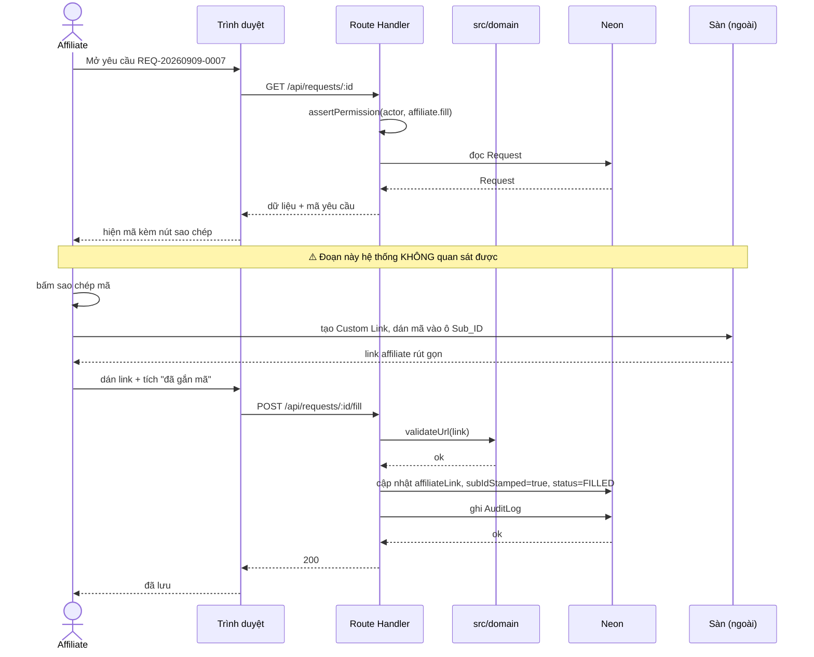
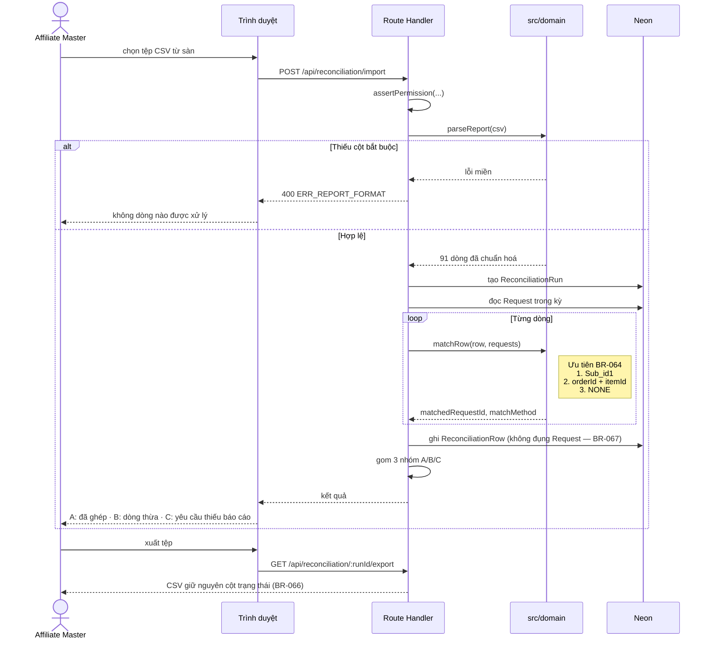
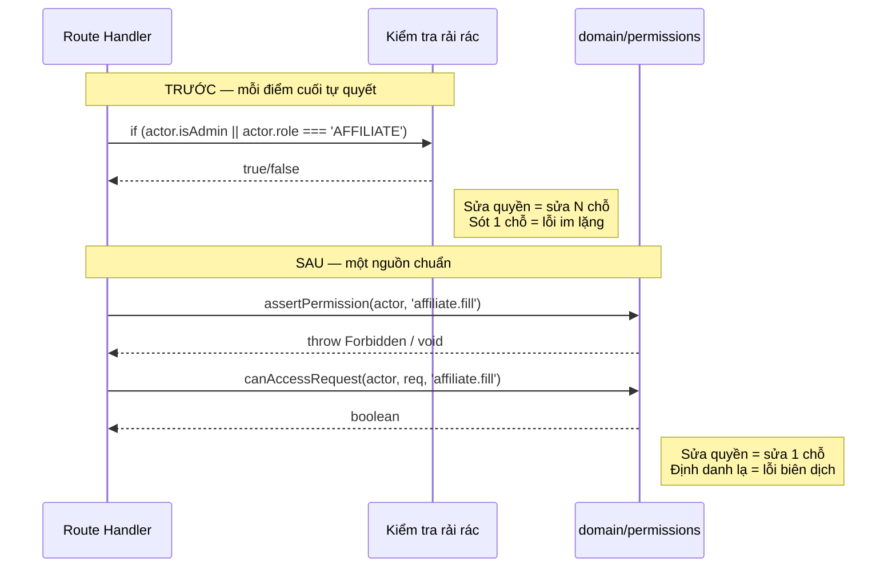

# Sequence

| 📄 **Metadata** | 📑 **Details** |
|:---|:---|
| **Doc ID** | `diagrams-sequence` |
| **Version** | `1.0.0` |
| **Status** | 🟡 **Draft** |
| **Last Updated** | `2026-08-11` |
| **Owner** | Quành (Admin) |
| **Upstream** | [sdd], [tech-spec-architecture] |
| **Downstream** | — |

Chỉ vẽ các tương tác **vượt qua ranh giới tầng** hoặc **gọi ra ngoài hệ thống**. Tên actor khớp tên container ở `c4.md`.

## 1. Điền link kèm Sub_ID — luồng có ranh giới ngoài

Đây là luồng quan trọng nhất trong cả dự án, và điều đáng chú ý là **một đoạn của nó nằm ngoài hệ thống**.

**Khối `Note` là toàn bộ TR-8 gói gọn trong một dòng.** Link rút gọn của sàn không lộ tham số, nên hệ thống không có cách nào xác minh Sub_ID đã thực sự được gắn. Ô tích là **lời khai**, không phải bằng chứng.

Hệ quả cho việc thiết kế: không chặn khi người dùng không tích. Chặn thì họ sẽ tích bừa để qua cửa, và ta mất luôn tín hiệu — biến một dữ liệu yếu thành một dữ liệu nói dối.

Cách kiểm chứng duy nhất là **hậu kiểm**, ở sơ đồ số 2.

## 2. Nạp báo cáo và ghép — luồng vượt tầng

**`matchRow` nằm trong `src/domain` chứ không trong route handler.** Đó là lý do nó test được bằng 91 dòng dữ liệu thật mà không cần cơ sở dữ liệu — và ghép sai là loại lỗi im lặng, đúng tiêu chí ở tech-spec §2.2.

**Mũi tên ghi `ReconciliationRow` không chạm vào `Request`.** BR-067: nạp báo cáo là phép đọc. Nếu ghép sai, không có gì hỏng — chỉ cần xoá lần nạp và làm lại.

## 3. Chuyển đổi thẩm quyền — trước và sau

Không phải sơ đồ chạy máy, mà là sơ đồ để **so sánh hai trạng thái mã nguồn**.

Thứ tự chuyển đổi bắt buộc ở tech-spec §5.2: viết ma trận phản ánh **hành vi hiện tại** → test xanh → thay từng điểm cuối → **rồi mới** thêm vai mới. Làm ngược thì khi có lỗi, bạn không phân biệt được do chuyển đổi hay do vai mới — và bạn đang gỡ lỗi mù trên hệ thống có người dùng thật.
